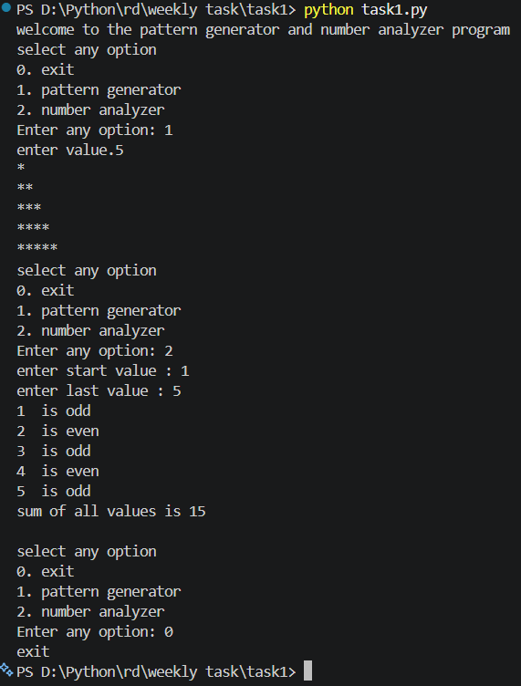

# Number Analyzer & Pattern Program

## Overview
This Python program uses a menu-driven approach with `match-case` statements.



The program performs:
1. Star Pattern Printing
2. Number Analyzer (Odd/Even + Sum)
3. Exit Option

---

# Concepts Used

- while loop
- for loop
- nested loop
- match-case
- if-else
- user input
- range()
- arithmetic operators

---

# Program Explanation

## Infinite Loop

```python
while True:
```

This loop runs continuously until the user selects Exit.

---

# Menu Option Input

```python
n = int(input("Enter any option: "))
```

Takes option input from the user.

---

# Match Case

```python
match n:
```

Used to execute different blocks based on user choice.

---

# Case 0 → Exit Program

```python
case 0:
    print("exit")
    break
```

- Prints exit message
- `break` stops the loop and program ends

---

# Case 1 → Star Pattern

```python
case 1:
    a = int(input("enter value."))
```

User enters number of rows.

---

## Pattern Logic

```python
for i in range(1, x + 1):
```

Controls rows.

Example:
If x = 5

Rows:
```text
1
2
3
4
5
```

---

## Inner Loop

```python
for j in range(1, i + 1):
```

Prints stars in each row.

Example:
- Row 1 → *
- Row 2 → **
- Row 3 → ***

---

## Output Example

```text
*
**
***
****
*****
```

---

# Case 2 → Number Analyzer

```python
first = int(input("enter start value : "))
last = int(input("enter last value : "))
```

Takes starting and ending numbers.

---

# Sum Variable

```python
sum = 0
```

Stores total sum of numbers.

---

# Loop Through Range

```python
for i in range(first, last + 1):
```

Loops from start value to end value.

Example:
If:
```text
first = 1
last = 5
```

Loop runs:
```text
1 2 3 4 5
```

---

# Odd or Even Logic

```python
if i % 2 == 0:
```

- If remainder is 0 → Even
- Otherwise → Odd

---

# Sum Logic

```python
sum = sum + i
```

Adds each number to total sum.

---

# Output Example

```text
1 is odd
2 is even
3 is odd
4 is even
5 is odd

sum of all values is 15
```

---

# Invalid Input

```python
case _:
    print("invalid input")
```

Runs when user enters any invalid option.

---

# Sample Menu

```text
0. Exit
1. Star Pattern
2. Number Analyzer
```

---

# Author

Krish Patel